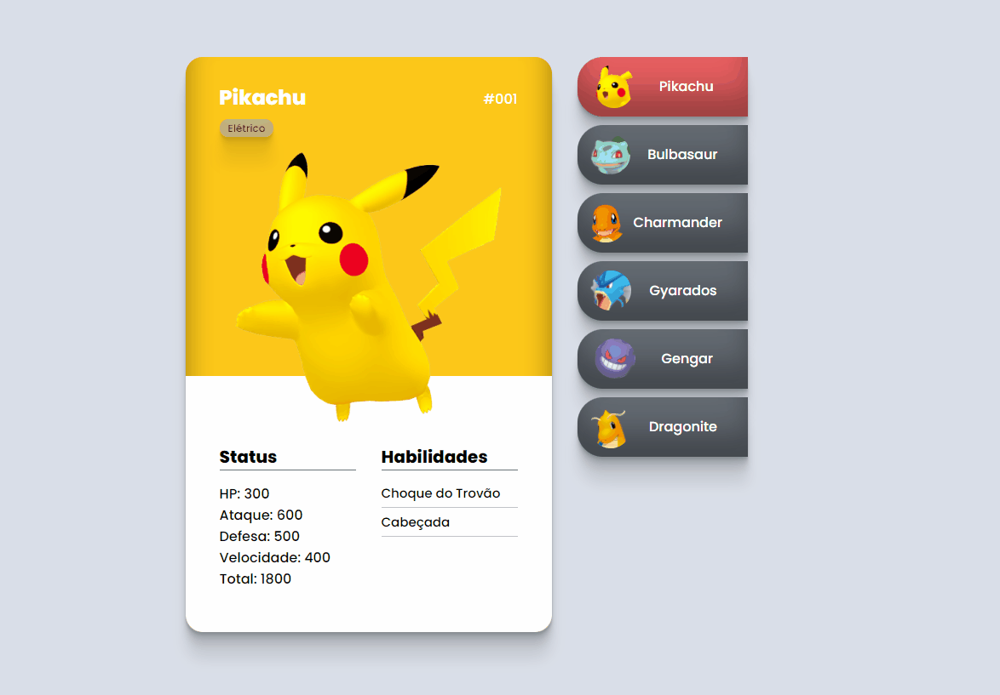

# Pokedex 🎮
Criação de um card de pokemon, onde ao selecionarmos os personagens fazemos o botão ressaltar e mudar de cor. Cada card personalizado e com a responsividade trabalhada para as telas menores.

## Tecnologias usadas 💻

- HTML
- CSS
- JAVASCRIPT

